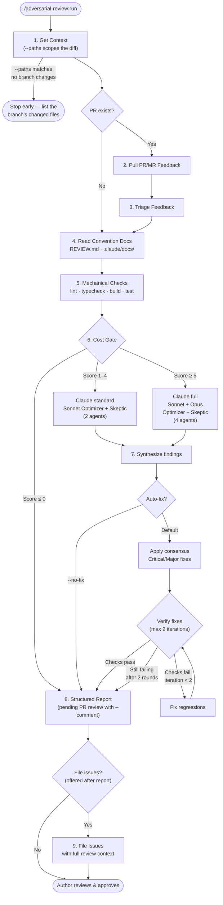

# adversarial-review


**Multi-model, adversarial code review for Claude Code.**

> Fork of [ng/adversarial-review](https://github.com/ng/adversarial-review). The
> review protocol, agents, and most of this repository are the original author's
> work; this fork drops cross-vendor review, adds a dead-code lens, and makes PR
> commenting opt-in. See [Credits](#credits).

Free mechanical checks run first. Then two agents — **The Optimizer** and **The
Skeptic** — review your code independently and challenge each other's findings.
Only findings that survive the challenge at high confidence get auto-fixed, and a
bounded verification loop catches regressions from the fixes themselves.

- **Adversarial by design** — every finding must survive a second, skeptical
  pass backed by command output, not reasoning alone.
- **Cost-gated** — mechanical checks are free and run first; expensive LLM review
  scales to the size and risk of the diff.
- **Multi-model** — Sonnet and Opus review the same diff from different context
  angles, and their agreement is the strongest signal in the synthesis.

## Install

```bash
/plugin marketplace add emouty/adversarial-review
/plugin install adversarial-review@emouty-plugins
```

Re-run both commands to update.

## Usage

```bash
/adversarial-review:run              # auto-fix (default), auto-detect PR
/adversarial-review:run 405          # auto-fix, specific PR
/adversarial-review:run --no-fix     # review only, no code modifications
/adversarial-review:run --no-fix 405 # review only, specific PR
/adversarial-review:run --paths "src/api/**,src/auth/**"  # review only branch changes under these paths
/adversarial-review:run --comment    # also post findings to the PR as a pending review
```

Flags combine — see [Configuration](docs/configuration.md) to set defaults once
instead of passing them every run.

## How it works



1. **Parse arguments** — PR number, `--no-fix`, `--paths` scope, `--comment`, and
   config defaults from `adversarial-review.json`.
2. **Get context** — branch, diff (scoped by `--paths`), platform detection
   (GitHub/GitLab).
3. **Pull PR/MR feedback** — CodeRabbit, Copilot, and human review comments.
4. **Triage feedback** — fix now, note for the report, or dismiss.
5. **Read convention docs** — `REVIEW.md`, `.claude/docs/` review lenses.
6. **Mechanical checks (free)** — lint, typecheck, build, tests before any LLM
   spend.
7. **Adversarial review** — change-type classification and weighted escalation
   scoring pick standard (2 agents) or full (4 agents) depth, spawned in two
   waves: Optimizers first, Skeptics after the Optimizer merge lands. Reviewers
   run as background agents (follow along with `← for agents`, or watch
   `.reviews/<branch_safe>/`).
8. **Synthesize** — confidence-based filtering and a Haiku scoring pass, then
   apply consensus fixes (auto-fix) or report them as suggestions (review-only).
9. **Structured report** — findings land in the local report and a persistent
   `summary.md`; with `--comment`, they are also posted as an unpublished
   pending PR/MR review. Followed by an optional issue-filing step for
   deferred, disputed, and pre-existing items.

For the wave-by-wave detail and the reasoning behind each stage, see
[Design rationale](docs/design-rationale.md).

## vs. the built-in `/code-review`

Claude Code ships a built-in `/code-review` with effort tiers and a cloud "ultra"
mode. This plugin overlaps on the basics but differs in mechanism:

- **Adversarial verification** — a second pass (The Skeptic) must independently
  confirm or refute every finding, with verdicts backed by command output rather
  than reasoning alone.
- **Consensus-gated auto-fix** — only findings that survive the Skeptic at high
  confidence are fixed, followed by a bounded verify loop (max 2 iterations).
- **GitLab support** — MR feedback, inline discussions, and issue filing via the
  GitLab API.
- **PR-feedback triage** — pulls CodeRabbit/Copilot/human comments through the
  same pipeline.
- **Issue filing** — deferred, disputed, and pre-existing findings can be filed
  as issues with the full debate context.

For a quick single-pass review of a working diff, the built-in command is cheaper
and faster.

## Severity levels

| Marker | Severity | Meaning |
|--------|----------|---------|
| 🔴 | Critical | Universal bug — fires regardless of inputs/environment. Fix before merging |
| 🟡 | Major | Significant issue, strongly recommend fixing |
| 🟢 | Minor | Worth fixing but not blocking |
| ⚪ | Nit | Stylistic or minor improvement |
| 🟣 | Pre-existing | Bug in surrounding code, not introduced by this PR |

## Review artifacts

Agent reports are saved to `.reviews/<branch_safe>/` (branch names are sanitized —
`feat/foo` becomes `feat-foo`). The `summary.md` is the artifact of record — it
captures what was fixed, disputed, deferred, and any filed issue numbers. The
review adds `.reviews/` to `.gitignore` automatically, so artifacts never land in
an auto-fix commit. Commit `summary.md` files separately if you want review
history.

## Issue filing

Issue filing is **offered after the review completes** — the plugin runs the full
review uninterrupted, then asks whether you want issues created for deferred,
disputed, and pre-existing findings. Each issue carries the full review context:
problem description, Optimizer reasoning, Skeptic challenge (with confidence
score), suggested fix, and source PR/MR reference. Works with both GitHub (`gh`)
and GitLab (API via `$GITLAB_PAT`).

## Documentation

| Doc | What's inside |
|-----|---------------|
| [Configuration & customization](docs/configuration.md) | `REVIEW.md`, flag defaults, scoped reviews |
| [GitHub Actions & CI](docs/github-actions.md) | Workflow, inputs, fork-PR safety, release automation |
| [Design rationale](docs/design-rationale.md) | Research foundations, patterns from Claude Code internals, known limitations |

## Plugin layout

The plugin manifest is `.claude-plugin/plugin.json`; the review workflow lives in
`claude/skills/`. `claude/skills/run/SKILL.md` is the single source for the whole
protocol: artifact contract, finding/verdict schemas, severity and signal-gate
definitions.

## Changelog

See [CHANGELOG.md](CHANGELOG.md) for release history.

## Credits

Based on [ng/adversarial-review](https://github.com/ng/adversarial-review) by
[ng](https://github.com/ng): the Optimizer/Skeptic design, the cost gate, the
review protocol, the GitHub Action, and the docs all originate there. Upstream
history up to v1.6.1 is preserved in [CHANGELOG.md](CHANGELOG.md) and the git
log. Changes specific to this fork are listed under `Unreleased`.

## License

MIT, see [LICENSE](LICENSE). Copyright remains with the original author for the
upstream work.
