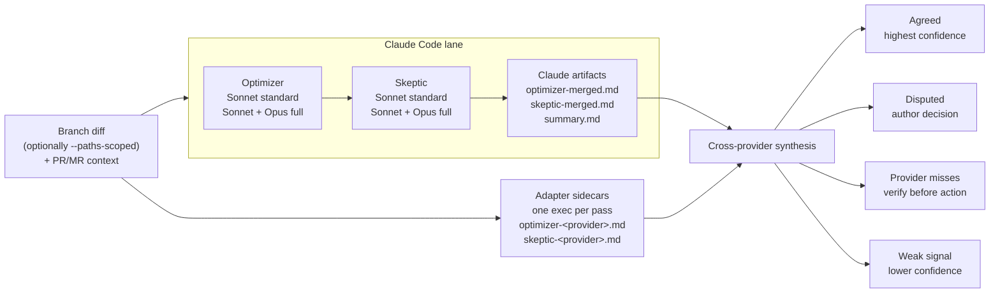

# Cross-provider review

An all-Claude reviewer pool (Sonnet + Opus) shares blind spots. Adding a
different vendor — different training, different failure modes — turns agreement
into signal:

- A finding **both vendors** independently flag is almost certainly real.
- A finding **only the other vendor** raises is blind-spot coverage one vendor
  can't give you.

The interop layer between providers is deliberately **files, not APIs**: every
lane writes comparable `.reviews/<branch_safe>/` artifacts, and synthesis reads
those files. Any provider whose CLI can follow a prompt and write markdown can
join.

## The `lanes` adapter registry

Extra reviewer lanes are **configured, not coded**. The `lanes` key in
`adversarial-review.json` maps a provider slug to an adapter: a `probe` command
that proves the CLI is installed and authenticated, an `exec` template run once
per pass, an optional `guard` flag, and an informational `models` string.

```json
{
  "lanes": {
    "gemini": {
      "probe": "gemini --version",
      "exec": "gemini --prompt \"$(cat {prompt_file})\" > {output_file}",
      "guard": true,
      "models": "gemini-3-pro"
    }
  }
}
```

**Executable adapters are honored from the user-level
`~/.claude/adversarial-review.json` only.** The project-level
`.claude/adversarial-review.json` ships with the repo under review, and repo
content must never define commands the review executes. A project-level `lanes`
entry may only be `false`, disabling that user-defined lane for this repo; any
object value there is ignored with a note.

Full field schema, slug rules, and an add-a-provider checklist:
[Configuration](configuration.md#adding-more-providers-lanes) and
[`review-protocol.md`](review-protocol.md#provider-adapter-registry).

## Lifecycle of a lane

1. **Probe** at argument-parsing time. Non-zero exit drops the lane with a note.
2. **One CLI call per pass**, launched in the same wave as the Claude reviewers
   of that pass — the Skeptic call only after `optimizer-merged.md` is on disk.
3. **Process exit is the only completion signal**; a growing report file never
   means "done", so a stalled process's partial report is never merged as
   complete.
4. **Bounded at ~10 minutes** past the Claude wave, then killed.
5. **Never blocks.** A failed, missing, or empty report is reported as "lane
   unavailable for this pass" and the review proceeds. A lane can only ever add
   coverage.
6. **Report-only.** Lanes write only their own `.reviews/` artifacts. For
   adapters that set `"guard": true` (no read-only sandbox available), the lead
   wraps each pass in a baseline-aware tracked-file guard: snapshot before
   launch, then revert only what the lane newly dirtied. Pre-existing
   uncommitted work is never touched.

## How lanes flow into one synthesis



Cross-vendor agreement outweighs agreement inside one vendor's model family: two
vendors share fewer blind spots than Sonnet and Opus do, so a finding both
independently raised is the highest-confidence signal available. Provenance
tables in the report and `summary.md` name the lane behind every finding, so
cross-vendor agreement is visible at a glance.

Extra lanes are local-CLI only for now; the GitHub Action runs Claude-only. For
CI, see [GitHub Actions](github-actions.md).
